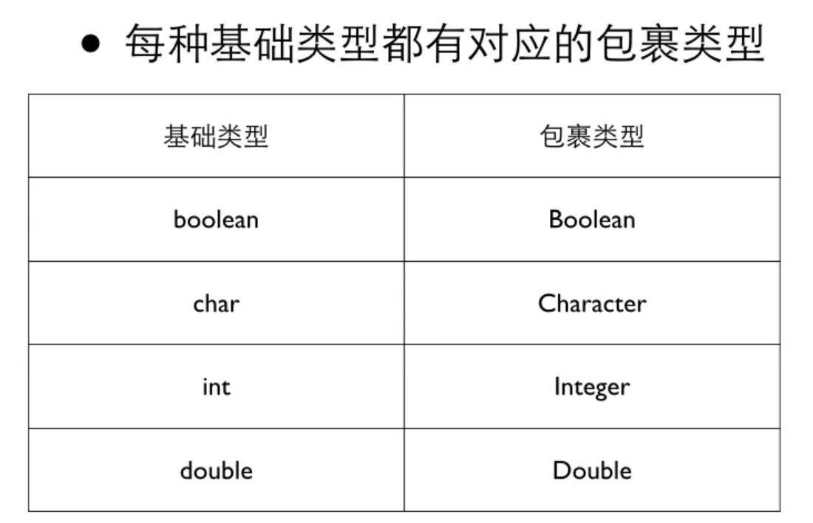

# Java基础知识

## 输入和输出

输入：

```java
Scanner in = new Scanner(System.in);

System.out.println(in.next());   //方法一
System.out.println(in.nextLine());    //方法二
```

> 只有遇到`next():`、`nextLine()`才会触发输入：
>
> **next()**:
>
> - 一定要读取到有效字符后才可以结束输入。
> - 对输入有效字符之前遇到的空白，next() 方法会自动将其去掉。
> - 只有输入有效字符后才将其后面输入的空白作为分隔符或者结束符。
> - 不能得到带有空格的字符串。
>
> **nextLine()**：
>
> - 以Enter为结束符,也就是说 nextLine()方法返回的是输入回车之前的所有字符。
> - 可以获得空白。
>
> 如果要输入 int 或 float 类型的数据，在 Scanner 类中也有支持，但是在输入之前最好先使用` hasNextXxx() `方法进行验证，再使用 `nextXxx() `（nextInt()、nextDouble()……）来读取：
>
> ```java
> if (scan.hasNextInt()) {// 判断输入的是否是整数            
>     i = scan.nextInt();            // 接收整数            
>     System.out.println("整数数据：" + i);        
> }
> ```


输出：

```java
System.out.println(input);
System.out.println("%2.f",sum);    //保留两位小数
```

完整代码：

```java
package hello;

import java.util.Scanner;

public class Hello {
    public static void main(String[] args) {
        Scanner in = new Scanner(System.in);
        Object i = in.nextLine();
//        System.out.println(in.next());
//        System.out.println(in.nextLine());
        System.out.println(i);
        System.out.println("2+3="+5);
        System.out.println("2+3="+2+3);
        System.out.println("2+3="+(2+3));
        System.out.println(2+3+"=2+3");
    }
}
```

## 类型转换

方法一：输入时自动转换

```java
Scanner in = new Scanner(System.in)
int i;
i = in.nextDouble();      
```

方法二：输出时转换

int转为double可以自动进行：float = int正确

float转为int需要手动：int = float会出错，需要进行强制转换（去掉小数部分）

```java
int i;
i = (int)(3/2.0)    #去掉小数部分
```

## 比较优先级

判断是否相等的`==`和`!=`的优先级比其他的低，并且连续的关系运算是从左到右进行的：

```python
5>3 == 6>4    //true
6>5>4      //变成true>4，false
a == b == true     //true
a == b == 6      //变成true==6，false
a == b > false     //先进行b>false，无法比较，false
(a == b) > false    //true和false无法比大小

5 == 5.0    //true
1.0 == 0.1+0.1+0.1+0.1+0.1+0.1+0.1+0.1+0.1+0.1    //false，浮点运算有误差
```

判断两个浮点数大小：将两个浮点数取其差数的绝对值，比一个很小的数小即为相等

```java
Math.abs(f1-f2) < 1e-6
```

## 分支语句

### if-else

### switch-case-default

> java中可以用字符串来处理switch-case

```java
switch(控制表达式) {    //控制表达式只能是整数型的结果，其结果对应的是case后面的常量
    case 常量: 
        语句;
        break;     /  /如果没有break，则会继续进行下一个case/default语句，直到break
    case 常量: 
        语句;
        break;
    case 常量: 
        语句;
        break;
    ……
    default:
        语句;
        break;
}
```

```java
switch(s) {
    case "this":
        ...
        break;
    case "that":
        ...
        break;
}
```

## 循环语句

### wihle(){}

至少执行0次

### do{}while()

至少执行1次

### for

多重循环的跳出：在想跳出的for的外面写`OUT`定位，在需要跳的地方写`break OUT`;即可跳出到OUT下的for循环之外。
```java
...
OUT:
for 
    for
        for
            for
                for
                    break OUT;
```

continue同理，默认跳过当前循环，但加上标号后，可以对标号下的for循环起作用。

## 逻辑运算

非`!`，与`&&`，或`||`


```java
not age > 20   //先进行not age，再进行>
```

## 数组

<类型>[] <名字> = new <类型>[元素个数];

元素个数必须给出，一定是整数，**可以是变量**

```java
int[] n = {1,2,3,4,5};
int[] numbers = new int[100];       //创建一个放100个int的数组
```

> **注意：java的数组的元素个数可以是变量！！**

```java
int t;
int[] numbers = new int[t];       //创建一个放100个int的数组
```

> **注意：java的数组具有length变量，表示数组的长度（定义的长度）**

### 数组遍历

### 方法一：for循环

### 方法二：for-each循环⭐

> 适合遍历找数，但是无法判断当前数是在什么位置，也无法通过修改k的值修改数组中的数值

``` java
int[] data = new int[10];
int x;
boolean found = false;
//判断data数组中是否有值为x
for (int k : data) {
    if (x == k) {
        found = true;
    }
}
```

### 二维数组

```java
int[][] a = {
    {1,2,3,4},
    {1,2,3},
};    //2行4列

int[][] b = new int[3][5];

row = b.length;    //行
column = b[0].length;    //列
```

## 字符类型

### 字符（''）

用的是unicode编码

```java
char c = 'a';
char c1 = '汉';
```

可以做加法、减法

查字符的ASCII（汉字比所有英文字符都大）

```java
char c = 'A';
System.out.println((int)c);     //65
```

```java
char c = 65;
System.out.println(c);    //A 
```

### 逃逸字符

加`\`就能正常打印

### 包裹类型



#### 与基础类型的共性

可以相互转换

```java
int i = 10;
Integer k = 10;
i = k;
```

#### 包裹类型的特性

##### Integer

`Integer.MAX_VALUE`能返回Integer的最大长度

##### Character


```java
System.out.println(Character.isDigit('6'));
```

### 字符串（""）

#### 字符串的创建

```java
String s = new String("a String");

String s = "hello";
```

字符串可以用`+`连接

#### 字符串的输入⭐

方法一：使用`in.next()`，对于输入的字符串，按照空格分割，将第一个小字符串存入s。

方法二：使用`in.nextLine()`，以回车分割，在存入的字符串中允许有空格。

```java
Scanner in = new Scanner(System.in);
String s;
//输入 This is a test.
//方法一：
s = in.next();     //输出 This
//方法二：
s = in.nextLine();    //输出 This is a test.
System.out.println(s);
```

#### 字符串的比较

方法一：比较是否为同一个字符串（指针相同）

```java
if (input == "bye") {
    ...
}
```

方法二：比较内容是否相同⭐（String应该用`.equals()`比较）

``` java
if (inputs.equals("bye")) {
    ...
}
```

#### 字符串的操作

##### `.compareTo()`比较大小

先从左往右比较字符的unicode，再比较长度

返回1表示s1比s2大，返回0表示相等，返回-1表示s2比s1大。

```java
s1.compareTo(s2);    
```

##### `.length()`显示长度

返回字符串长度

```java
str1.length();  
```

##### `.charAt(index)`访问String里字符

返回index位置上的单个字符，index的范围是0~length()-1

> 不能用for-each循环遍历字符串

```java
s1.charAt(3)
```
循环遍历字符串

```java
for (int i=0;i<s1.length();i++) {
    System.out.println(s1.charAt(i));
}
```

##### `.subString(index)`获取index及其之后的内容

```java
s1.subString(2);
```

##### `.subString(index1,index2)`获取下标在 [index1,index2) 的内容

```java
s1.subString(2,4)
```

##### `.indexOf(c)`得到c字符所在位置

>  `.lastIndexOf(c)`从右边找

-1表示不存在

```java
s1.indexOf('a');
```

##### `.indexOf(c,index)`从下标为index位置开始寻找c字符

> `.lastIndexOf(c,index)`从右边找

```java
s1.indexOf('a',6);
```

##### `.indexOf(str)`找字符串str的所在的起始位置

> `.lastIndexOf(str)`从右边找

```java
s1.indexOf("wry");
```

## Math类

### `Math.abs()`求绝对值

```java
Math.abs(-12);
```

### `Math.round()`将浮点数四舍五入变整数

```java
Math.round(10.645);    //11
```

### `Math.random()`得到0~1之间的随机数

```java
Math.random()*100;    
```

### `Math.pow(a,b)`求a^b，返回浮点数

```java
Math.pow(2,3);   //8.0
```

## 函数

### 定义

```java
public class Hello {
    public static void test() {
        
        //可以写 return;   //不能带值
    }
    public static int sum() {
        
        return 
    }
    public static void main(String[] args) {
        
    }
}
```

### 类型转换

#### 编译器自动处理

char -> int -> double（表示如果定义为int，但是输入的是char，编译器会自动转为char的ASCII码）

#### 强制转换

```java
(int)a
```


# Java进阶知识

## 类和对象

### 用类制造对象

1. 打开Shapes文件夹
2. 配置IDEA设置


类定义了对象，对象是类的实体


封装：把数据和对数据的操作放在一起

例：售货机

```java
package vendingmachine;

public class VendingMachine {
    int price = 80;
    int balance;
    int total;

    void showPrompt() {
        System.out.println("Welcome");
    }

    void insertMoney(int amount) {
        balance = balance + amount;
    }

    void showBalance() {
        System.out.println(balance);
    }

    void getFood() {
        if (balance >= price) {
            System.out.println("Here you are.");
            balance = balance - price;
            total = total + price;
        }
    }

    public static void main(String[] args) {
        VendingMachine vm = new VendingMachine();
        VendingMachine vm1 = new VendingMachine();     //每个对象的属性一样但是值不一样
        vm.showPrompt();
        vm.showBalance();
        vm.insertMoney(100);
        vm.getFood();
        vm.showBalance();

        vm1.showPrompt();
        vm1.showBalance();
    }
}
```


1.3


# 基础例题

## 素数

如果是1、2，是素数；

如果是偶数直接over；

除去上面两种情况，只需要判断从3开始的每一个奇数，一直到x的平方根

```java
for (int i=3;i<Math.sqrt(x);i+=2) {
    if (x % i == 0) {
        isPrime = false;
        break;
    }
}
```


